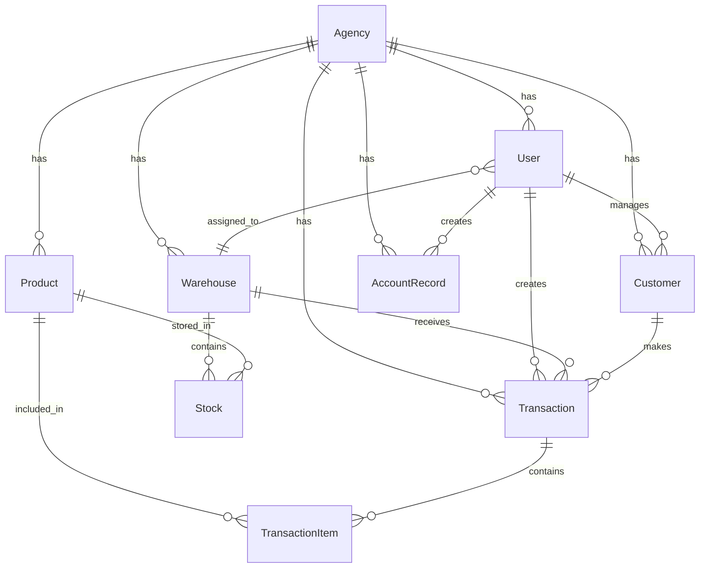

# Al-Ahlam System - Technical Documentation
# الوثائق الفنية - نظام الأحلام

## 🏗️ System Architecture | البنية المعمارية

### Technology Stack

#### Frontend
- **Framework**: Next.js 16.1.1 (App Router)
- **React**: 19.2.3
- **Styling**: Tailwind CSS 4.0
- **Language**: TypeScript 5.9.3
- **UI**: Server Components + Client Components

#### Backend
- **Runtime**: Node.js
- **Framework**: Next.js API Routes / Server Actions
- **ORM**: Prisma 6.19.0
- **Database**: SQLite (file:./dev.db)

#### Development Tools
- **Linting**: ESLint 9
- **Compiler**: React Compiler (Babel Plugin)
- **Package Manager**: npm

---

## 📁 Project Structure | هيكل المشروع

```
al-ahlam-system/
├── prisma/
│   ├── schema.prisma          # Database schema
│   └── dev.db                 # SQLite database file
├── public/
│   ├── logo.jpg               # Application logo
│   └── ...                    # Static assets
├── scripts/
│   ├── seed-turso.js          # Database seeding script
│   ├── apply-schema-turso.js  # Schema migration script
│   └── ...                    # Utility scripts
├── src/
│   ├── app/
│   │   ├── page.tsx           # Login page
│   │   ├── layout.tsx         # Root layout
│   │   ├── globals.css        # Global styles
│   │   └── dashboard/
│   │       ├── layout.tsx     # Dashboard layout with sidebar
│   │       ├── page.tsx       # Dashboard home
│   │       ├── agencies/      # Agency management
│   │       ├── products/      # Product management
│   │       ├── warehouses/    # Warehouse management
│   │       │   └── [id]/      # Warehouse details (dynamic route)
│   │       ├── users/         # User management
│   │       ├── customers/     # Customer management
│   │       ├── reps/          # Sales representatives
│   │       │   └── [id]/      # Rep details & audit (dynamic route)
│   │       └── reports/
│   │           └── sales/     # Sales reports
│   └── lib/
│       ├── db.ts              # Prisma client initialization
│       └── actions.ts         # Server actions (API layer)
├── package.json
├── tsconfig.json
├── next.config.ts
├── tailwind.config.ts
└── README.md
```

---

## 🗄️ Database Schema | مخطط قاعدة البيانات

### Entity Relationship Diagram



### Models Overview

#### 1. **User** (المستخدم)
```prisma
model User {
  id             String   @id @default(uuid())
  username       String   @unique
  password       String
  name           String
  image          String?
  role           Role     @default(ACCOUNTANT)
  agencyId       String?
  warehouseId    String?
  pricingType    String?  // WHOLESALE | RETAIL
  createdAt      DateTime @default(now())
  updatedAt      DateTime @updatedAt
}
```

**Roles**:
- `ADMIN` - Full system access
- `MANAGER` - Agency-level management
- `ACCOUNTANT` - Financial operations
- `WAREHOUSE_KEEPER` - Inventory management
- `SALES_REPRESENTATIVE` - Sales operations

#### 2. **Agency** (التوكيل)
```prisma
model Agency {
  id        String   @id @default(uuid())
  name      String
  address   String?
  phone     String?
  image     String?  // Base64 encoded
  createdAt DateTime @default(now())
  updatedAt DateTime @updatedAt
}
```

#### 3. **Warehouse** (المستودع)
```prisma
model Warehouse {
  id        String   @id @default(uuid())
  name      String
  agencyId  String
  createdAt DateTime @default(now())
  updatedAt DateTime @updatedAt
}
```

**Special**: Each Sales Representative has a virtual warehouse (id = user.id)

#### 4. **Product** (المنتج)
```prisma
model Product {
  id             String  @id @default(uuid())
  name           String
  description    String?
  barcode        String? @unique
  factoryPrice   Decimal
  wholesalePrice Decimal
  retailPrice    Decimal
  agencyId       String
  image          String? // Base64 encoded
  createdAt      DateTime @default(now())
  updatedAt      DateTime @updatedAt
}
```

**Price Levels**:
- `factoryPrice` - Cost price
- `wholesalePrice` - Wholesale selling price
- `retailPrice` - Retail selling price

#### 5. **Stock** (المخزون)
```prisma
model Stock {
  id          String @id @default(uuid())
  warehouseId String
  productId   String
  quantity    Int    @default(0)
  
  @@unique([warehouseId, productId])
}
```

**Unique Constraint**: One stock record per product per warehouse

#### 6. **Transaction** (المعاملة)
```prisma
model Transaction {
  id              String          @id @default(uuid())
  type            TransactionType // SALE | PURCHASE | RETURN_IN | RETURN_OUT
  totalAmount     Decimal
  userId          String
  agencyId        String
  warehouseId     String?
  customerId      String?
  paymentType     PaymentType     @default(CASH) // CASH | CREDIT | PARTIAL
  paidAmount      Decimal?
  remainingAmount Decimal?
  note            String?
  createdAt       DateTime        @default(now())
}
```

**Transaction Types**:
- `SALE` - Outgoing stock (warehouse deduction)
- `PURCHASE` - Incoming stock (warehouse addition)
- `RETURN_IN` - Customer return
- `RETURN_OUT` - Return to supplier

#### 7. **TransactionItem** (بند المعاملة)
```prisma
model TransactionItem {
  id            String   @id @default(uuid())
  transactionId String
  productId     String
  quantity      Int
  price         Decimal
  createdAt     DateTime @default(now())
}
```

#### 8. **Customer** (العميل)
```prisma
model Customer {
  id               String   @id @default(uuid())
  name             String
  phone            String?
  address          String?
  representativeId String
  agencyId         String
  createdAt        DateTime @default(now())
  updatedAt        DateTime @updatedAt
}
```

#### 9. **AccountRecord** (السجل المحاسبي)
```prisma
model AccountRecord {
  id          String            @id @default(uuid())
  type        AccountRecordType // INCOME | EXPENSE
  amount      Decimal
  description String
  agencyId    String
  userId      String
  createdAt   DateTime          @default(now())
}
```

---

## 🔧 Server Actions API | واجهة برمجة التطبيقات

### Agency Actions (إدارة التوكيلات)
```typescript
getAgencies() → Agency[]
createAgency(formData: FormData) → void
updateAgency(id: string, formData: FormData) → void
deleteAgency(id: string) → void
```

### Warehouse Actions (إدارة المستودعات)
```typescript
getWarehouses() → Warehouse[]
getWarehouse(id: string) → Warehouse | null
createWarehouse(formData: FormData) → void
deleteWarehouse(id: string) → void
getTransactions(warehouseId: string) → Transaction[]
performWarehouseAudit(warehouseId: string, auditData) → {success: boolean}
```

### Product Actions (إدارة المنتجات)
```typescript
getProducts() → Product[]
createProduct(formData: FormData) → void
updateProduct(id: string, formData: FormData) → void
deleteProduct(id: string) → void
```

### Stock Actions (إدارة المخزون)
```typescript
getStocks() → Stock[]
updateStock(
  warehouseId: string,
  productId: string,
  quantity: number,
  note?: string,
  factoryPrice?: number,
  updateBasePrice?: boolean,
  wholesalePrice?: number,
  retailPrice?: number
) → void

supplyStock(
  warehouseId: string,
  productId: string,
  addedQuantity: number,
  factoryPrice?: number,
  updateBasePrice?: boolean,
  wholesalePrice?: number,
  retailPrice?: number
) → void
```

### Sales Representative Actions (إدارة المندوبين)
```typescript
getRepStocks(repId: string) → Stock[]
getAllRepStocks() → Stock[]
loadStockToRep(formData: FormData) → void
updateRepStock(repId: string, productId: string, actualQuantity: number) → void
finalizeRepAudit(
  repId: string,
  warehouseId: string,
  auditItems: {productId: string, actualQuantity: number}[],
  paymentInfo: {type: 'CASH' | 'CREDIT' | 'PARTIAL', paidAmount?: number},
  remainingStockAction: 'RETURN' | 'KEEP'
) → {success: boolean, sessionId?: string}
```

### User Actions (إدارة المستخدمين)
```typescript
getUsers() → User[]
getAllUsers() → User[]
getCurrentUser() → {id: string, role: string, agencyId?: string}
createUser(formData: FormData) → void
updateUser(id: string, formData: FormData) → void
deleteUser(id: string) → void
toggleRepPricing(id: string) → void
setMockUser(id: string, role: string, agencyId?: string) → void
```

### Customer Actions (إدارة العملاء)
```typescript
getCustomers() → Customer[]
getRepCustomers(repId: string) → Customer[]
createCustomer(formData: FormData) → void
updateCustomer(id: string, formData: FormData) → void
deleteCustomer(id: string) → void
```

### Sales Reporting (تقارير المبيعات)
```typescript
getSalesReports(filters?: {
  agencyId?: string,
  repId?: string,
  startDate?: Date,
  endDate?: Date
}) → Transaction[]
```

---

## 🔐 Authentication System | نظام المصادقة

### Current Implementation (Mock Authentication)
```typescript
// Global state-based authentication
const g = global as any;
g.mockAuthUser = { id, role, agencyId };

// Get current user
async function getCurrentUser() {
  return g.mockAuthUser || { id: 'admin-id', role: 'ADMIN' };
}
```

### Login Flow
```
1. User enters username/password
2. System queries database for user
3. If found, sets global mock user
4. Redirects to /dashboard
5. All subsequent requests use getCurrentUser()
```

### Recommended Improvements
```typescript
// TODO: Implement proper authentication
// - Use NextAuth.js or similar
// - Hash passwords with bcrypt
// - Use JWT tokens
// - Implement session management
// - Add CSRF protection
```

---

## 🎨 UI Components & Patterns | مكونات الواجهة

### Layout Structure
```
Root Layout (app/layout.tsx)
  └── Login Page (app/page.tsx)
      OR
      Dashboard Layout (app/dashboard/layout.tsx)
        ├── Sidebar Navigation
        ├── Header with User Info
        └── Page Content
            ├── Dashboard Home
            ├── Agencies Page
            ├── Products Page
            ├── Warehouses Page
            ├── Users Page
            ├── Customers Page
            ├── Reps Page
            └── Reports Page
```

### Common UI Patterns

#### Modal Pattern
```typescript
// Used for Create/Edit forms
const [isOpen, setIsOpen] = useState(false);

<button onClick={() => setIsOpen(true)}>Add New</button>
{isOpen && (
  <div className="fixed inset-0 bg-black/50 flex items-center justify-center">
    <div className="bg-white rounded-lg p-6">
      <form action={serverAction}>
        {/* Form fields */}
      </form>
    </div>
  </div>
)}
```

#### Table Pattern
```typescript
// Used for listing data
<table className="w-full">
  <thead>
    <tr>
      <th>Column 1</th>
      <th>Column 2</th>
      <th>Actions</th>
    </tr>
  </thead>
  <tbody>
    {items.map(item => (
      <tr key={item.id}>
        <td>{item.field1}</td>
        <td>{item.field2}</td>
        <td>
          <button>Edit</button>
          <button>Delete</button>
        </td>
      </tr>
    ))}
  </tbody>
</table>
```

#### Form Pattern
```typescript
// Server action forms
<form action={serverAction}>
  <input name="field1" required />
  <input name="field2" />
  <button type="submit">Submit</button>
</form>
```

### Color Scheme
```css
/* Primary Colors (Emerald) */
--emerald-50: #ecfdf5
--emerald-100: #d1fae5
--emerald-600: #059669
--emerald-700: #047857
--emerald-800: #065f46

/* Accent Colors */
--blue-600: #2563eb
--red-600: #dc2626
--yellow-600: #ca8a04
--gray-100: #f3f4f6
--gray-700: #374151
```

---

## 🔄 Key Business Logic Flows | تدفقات منطق الأعمال

### 1. Stock Loading to Representative
```typescript
async function loadStockToRep(formData: FormData) {
  // 1. Parse input data
  const repId = formData.get('repId');
  const warehouseId = formData.get('warehouseId');
  const items = JSON.parse(formData.get('items'));
  
  // 2. Validate representative
  const rep = await prisma.user.findUnique({where: {id: repId}});
  
  // 3. Transaction: For each item
  await prisma.$transaction(async (tx) => {
    for (const item of items) {
      // 3a. Check warehouse stock
      const sourceStock = await tx.stock.findUnique({
        where: {warehouseId_productId: {warehouseId, productId: item.productId}}
      });
      
      if (sourceStock.quantity < item.quantity) {
        throw new Error('Insufficient stock');
      }
      
      // 3b. Decrement warehouse stock
      await tx.stock.update({
        where: {warehouseId_productId: {warehouseId, productId: item.productId}},
        data: {quantity: {decrement: item.quantity}}
      });
      
      // 3c. Increment rep stock (virtual warehouse)
      await tx.stock.upsert({
        where: {warehouseId_productId: {warehouseId: repId, productId: item.productId}},
        update: {quantity: {increment: item.quantity}},
        create: {warehouseId: repId, productId: item.productId, quantity: item.quantity}
      });
      
      // 3d. Log transaction
      await tx.transaction.create({
        data: {
          type: 'SALE',
          totalAmount: 0,
          userId: repId,
          agencyId: rep.agencyId,
          warehouseId: warehouseId,
          note: `Loading to rep: ${rep.name}`
        }
      });
    }
  });
}
```

### 2. Representative Audit & Sales Recording
```typescript
async function finalizeRepAudit(
  repId: string,
  warehouseId: string,
  auditItems: {productId: string, actualQuantity: number}[],
  paymentInfo: {type: 'CASH' | 'CREDIT' | 'PARTIAL', paidAmount?: number},
  remainingStockAction: 'RETURN' | 'KEEP'
) {
  await prisma.$transaction(async (tx) => {
    const soldItems = [];
    
    // 1. Calculate sold quantities
    for (const item of auditItems) {
      const currentQty = await getRepStock(repId, item.productId);
      const soldQty = currentQty - item.actualQuantity;
      
      if (soldQty > 0) {
        const product = await tx.product.findUnique({where: {id: item.productId}});
        const price = user.pricingType === 'WHOLESALE' 
          ? product.wholesalePrice 
          : product.retailPrice;
        
        soldItems.push({
          productId: item.productId,
          quantity: soldQty,
          price: price,
          total: soldQty * price
        });
        
        // Decrement rep stock
        await tx.stock.update({
          where: {warehouseId_productId: {warehouseId: repId, productId: item.productId}},
          data: {quantity: {decrement: soldQty}}
        });
      }
      
      // 2. Handle remaining stock
      if (item.actualQuantity > 0 && remainingStockAction === 'RETURN') {
        // Return to warehouse
        await tx.stock.upsert({
          where: {warehouseId_productId: {warehouseId, productId: item.productId}},
          update: {quantity: {increment: item.actualQuantity}},
          create: {warehouseId, productId: item.productId, quantity: item.actualQuantity}
        });
        
        // Zero out rep stock
        await tx.stock.update({
          where: {warehouseId_productId: {warehouseId: repId, productId: item.productId}},
          data: {quantity: 0}
        });
        
        // Log return transaction
        await tx.transaction.create({
          data: {
            type: 'PURCHASE',
            totalAmount: 0,
            userId: repId,
            agencyId: user.agencyId,
            warehouseId: warehouseId,
            note: `Return from rep: ${user.name}`
          }
        });
      }
    }
    
    // 3. Create sales transaction
    const totalAmount = soldItems.reduce((sum, item) => sum + item.total, 0);
    const transaction = await tx.transaction.create({
      data: {
        type: 'SALE',
        totalAmount: totalAmount,
        userId: repId,
        agencyId: user.agencyId,
        paymentType: paymentInfo.type,
        paidAmount: paymentInfo.paidAmount,
        remainingAmount: totalAmount - (paymentInfo.paidAmount || 0),
        items: {
          create: soldItems.map(item => ({
            productId: item.productId,
            quantity: item.quantity,
            price: item.price
          }))
        }
      }
    });
    
    return {success: true, sessionId: transaction.id};
  });
}
```

### 3. Warehouse Audit
```typescript
async function performWarehouseAudit(
  warehouseId: string,
  auditData: {productId: string, actualQuantity: number}[]
) {
  await prisma.$transaction(async (tx) => {
    for (const data of auditData) {
      // Upsert stock with actual quantity
      await tx.stock.upsert({
        where: {warehouseId_productId: {warehouseId, productId: data.productId}},
        update: {quantity: data.actualQuantity},
        create: {warehouseId, productId: data.productId, quantity: data.actualQuantity}
      });
    }
  });
}
```

---

## 📊 Data Flow Examples | أمثلة تدفق البيانات

### Example 1: Product Supply to Warehouse
```
1. Warehouse Keeper selects warehouse
2. Selects product and enters quantity
3. Enters factory price (optional: update base prices)
4. System:
   a. Creates/updates stock record
   b. Optionally updates product prices
   c. Creates PURCHASE transaction
   d. Logs transaction with items
5. Revalidates cache
6. UI updates automatically
```

### Example 2: Sales Representative Workflow
```
1. Load Stock:
   Warehouse → Rep Virtual Warehouse
   
2. Sell to Customers:
   Rep visits customers and sells products
   
3. Audit:
   a. Rep enters remaining quantities
   b. System calculates sold quantities
   c. Creates sales transaction
   d. Returns remaining stock to warehouse (optional)
   e. Generates sales report
```

---

## 🚀 Performance Optimizations | تحسينات الأداء

### Database Optimizations
- **Unique Constraints**: Prevent duplicate stock records
- **Indexes**: Automatic on foreign keys and unique fields
- **Transactions**: Atomic operations for data consistency
- **Cascade Deletes**: Automatic cleanup of related records

### Next.js Optimizations
- **Server Components**: Default for better performance
- **Dynamic Routes**: `[id]` for warehouse and rep details
- **Revalidation**: `revalidatePath()` for cache invalidation
- **Image Optimization**: Next.js Image component
- **Code Splitting**: Automatic with App Router

### React Optimizations
- **React Compiler**: Enabled via Babel plugin
- **Minimal Client Components**: Most UI is server-rendered
- **Form Actions**: Server actions for form handling

---

## 🔧 Development Setup | إعداد بيئة التطوير

### Prerequisites
```bash
- Node.js 20+
- npm or yarn
```

### Installation
```bash
# Clone repository
git clone <repository-url>
cd al-ahlam-system

# Install dependencies
npm install

# Generate Prisma client
npx prisma generate

# Apply database schema
npx prisma db push

# (Optional) Seed database
node scripts/seed-turso.js

# Run development server
npm run dev
```

### Environment Variables
```env
# .env file
DATABASE_URL="file:./dev.db"
NODE_ENV="development"
```

### Build for Production
```bash
# Build
npm run build

# Start production server
npm start
```

---

## 🐛 Debugging & Logging | التصحيح والسجلات

### Console Logging
```typescript
// Database connection
console.log('[DB] Using local SQLite database (./dev.db)');

// Login attempts
console.log(`[Login] Attempting login for: ${username}`);
console.log(`[Login] Success for ${username}`);

// Errors
console.error('[Login] Error during handleLogin:', error);
```

### Prisma Logging
```typescript
// Enable query logging
const prisma = new PrismaClient({
  log: ['query', 'info', 'warn', 'error'],
});
```

---

## 📝 Code Conventions | اتفاقيات البرمجة

### Naming Conventions
- **Files**: kebab-case (`customer-list.tsx`)
- **Components**: PascalCase (`CustomerList`)
- **Functions**: camelCase (`getCustomers`)
- **Constants**: UPPER_SNAKE_CASE (`DEFAULT_ROLE`)

### File Organization
- **Server Actions**: `src/lib/actions.ts`
- **Database**: `src/lib/db.ts`
- **Pages**: `src/app/**/page.tsx`
- **Layouts**: `src/app/**/layout.tsx`
- **Components**: Co-located with pages

### TypeScript Usage
- **Strict Mode**: Enabled
- **Type Safety**: Prisma-generated types
- **Any Usage**: Minimal, only where necessary

---

## 🔒 Security Considerations | اعتبارات الأمان

### Current Security Measures
- ✅ Server-side validation
- ✅ SQL injection protection (Prisma)
- ✅ XSS protection (React)
- ✅ CSRF protection (Next.js)

### Security Improvements Needed
- ⚠️ **Password Hashing**: Currently plain text
- ⚠️ **Session Management**: Mock authentication
- ⚠️ **Rate Limiting**: Not implemented
- ⚠️ **Input Sanitization**: Basic validation only
- ⚠️ **File Upload Security**: Base64 encoding only

### Recommended Implementations
```typescript
// 1. Password Hashing
import bcrypt from 'bcrypt';
const hashedPassword = await bcrypt.hash(password, 10);

// 2. Session Management
import NextAuth from 'next-auth';
// Configure NextAuth

// 3. Input Validation
import { z } from 'zod';
const schema = z.object({
  username: z.string().min(3).max(50),
  password: z.string().min(8)
});
```

---

## 📚 Additional Resources | موارد إضافية

### Documentation Links
- [Next.js Documentation](https://nextjs.org/docs)
- [Prisma Documentation](https://www.prisma.io/docs)
- [Tailwind CSS Documentation](https://tailwindcss.com/docs)
- [React Documentation](https://react.dev)

### Related Files
- `BUSINESS_REQUIREMENTS.md` - Business requirements and use cases
- `README.md` - Quick start guide
- `prisma/schema.prisma` - Database schema

---

**Last Updated**: January 2026  
**Version**: 0.1.0  
**Maintainer**: Development Team
